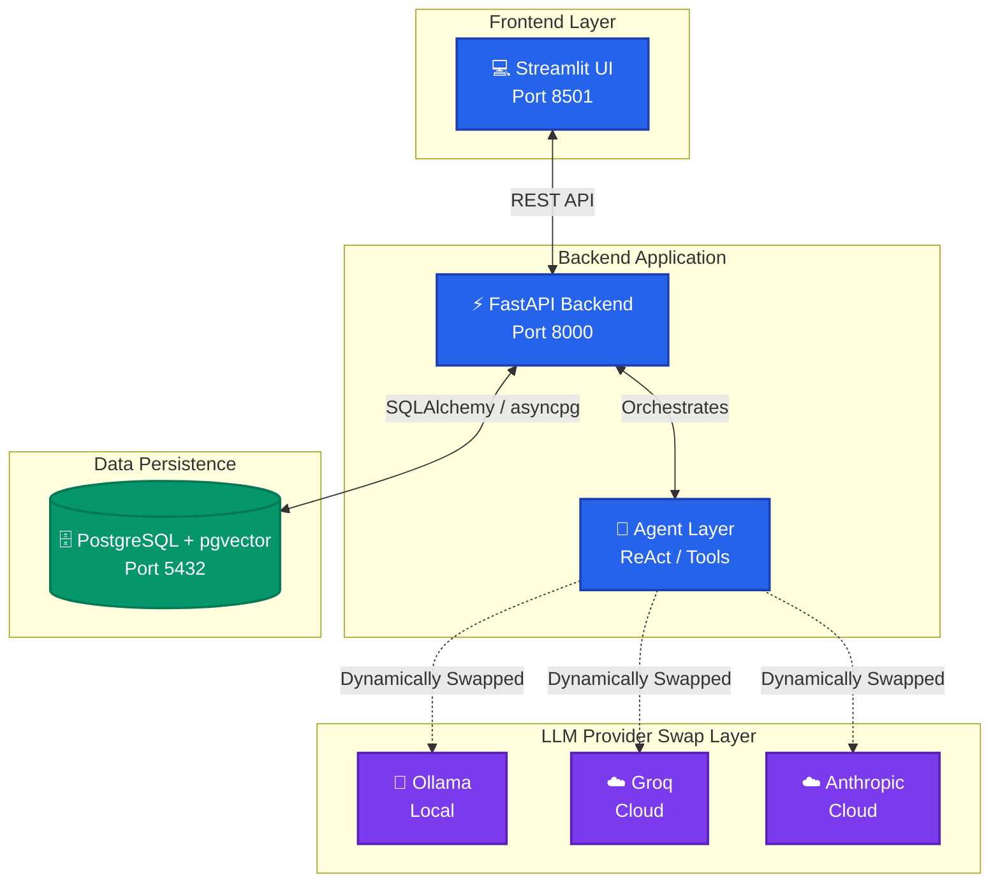

# 🎙️ The Lenny Growth Assistant

A full-stack, AI-powered conversational web application that answers product and growth questions grounded strictly in [Lenny's Podcast](https://www.lennyspodcast.com/) transcripts, with Ship 30 for 30 essay generation and in-app artifact rendering.

Built for the **Forward Deployed Engineer** Take-Home Assessment.

---

## 🌐 Live Cloud Deployment
- **Live Frontend App:** [https://lenny-frontend.onrender.com](https://lenny-frontend.onrender.com)
- **Live Backend API:** [https://lenny-backend.onrender.com](https://lenny-backend.onrender.com)
- **Interactive Swagger Docs:** [https://lenny-backend.onrender.com/docs](https://lenny-backend.onrender.com/docs)
- **Health Check Endpoint:** [https://lenny-backend.onrender.com/health](https://lenny-backend.onrender.com/health)

---

## 📑 Table of Contents
- [Live Cloud Deployment](#-live-cloud-deployment)
- [Quick Start](#-quick-start)
- [Architecture & Tech Stack](#-architecture--tech-stack)
- [Flexible LLM Configuration](#-flexible-llm-configuration)
- [Deliverables & Documentation](#-deliverables--documentation)
- [Manual Test Plan](#-manual-test-plan)
- [Automated Testing](#-automated-testing)
- [Troubleshooting](#-troubleshooting)

---

## 🚀 Quick Start

### 1. One-Command Docker Startup (Recommended)
```bash
# 1. Clone the repository
git clone https://github.com/Rahulreddy4444/The-Lenny-Growth-Assistant.git
cd "The Lenny Growth Assistant"

# 2. Configure environment
cp .env.example .env

# 3. Start the full stack
docker-compose up -d --build

# 4. Ingest transcripts into pgvector (first time only)
docker-compose exec backend python -m ingestion.ingest
```

- **Frontend UI:** [http://localhost:8501](http://localhost:8501)
- **FastAPI Docs:** [http://localhost:8000/docs](http://localhost:8000/docs)
- **Health Check:** [http://localhost:8000/health](http://localhost:8000/health)

---

### 2. Local Development Startup
```bash
# 1. Start Database & Ollama via Docker
docker-compose up -d postgres ollama

# 2. Setup Virtual Environment
python -m venv .venv
.\.venv\Scripts\Activate.ps1   # Windows
# source .venv/bin/activate    # Mac/Linux

# 3. Install Dependencies
pip install -r backend/requirements.txt -r frontend/requirements.txt -r ingestion/requirements.txt pytest

# 4. Ingest Transcripts
python -m ingestion.ingest

# 5. Start Backend & Frontend
# Terminal 1:
uvicorn backend.app.main:app --reload --host 0.0.0.0 --port 8000
# Terminal 2:
streamlit run frontend/app.py

*Note: For hot-reloading within Docker, use `docker-compose up -d --build`. The volumes are configured to sync local changes.*
```

---

## 🏗️ Architecture & Tech Stack



### 🛠️ Core Technologies

- 🐳 **Containerization:** The entire stack is fully containerized using **Docker** and **Docker Compose** for seamless local deployment and component networking.
- ⚡ **Backend (FastAPI):** High-performance asynchronous Python backend using SQLAlchemy 2.0, asyncpg, and strict Pydantic validation contracts.
- 🧠 **Agentic Layer (ReAct):** Claude Agent SDK integration with a custom fallback tool-use loop to execute skills (e.g., Ship 30 essay generation) and synthesize context.
- 🗄️ **Database (PostgreSQL + pgvector):** Vector database utilizing an HNSW cosine similarity index for lightning-fast retrieval of podcast transcript chunks.
- 🎨 **Frontend (Streamlit):** Reactive two-column UI featuring multi-turn session persistence, custom CSS theming (Dark/Light mode), and interactive side-by-side artifact rendering.
- 🛡️ **Security:** Server-side HTML sanitization using the Rust-based `nh3` library to neutralize untrusted DOM elements and block XSS attacks.

---

## 🔄 Flexible LLM Configuration

The application allows seamless switching of the underlying LLM provider in `.env` without modifying code:

| Provider | Setting in `.env` | Description |
| :--- | :--- | :--- |
| **Ollama** (Local Demo) | `LLM_PROVIDER=ollama` | Local offline inference with `llama3.1:8b` & `nomic-embed-text`. |
| **Groq** (Fast Cloud) | `LLM_PROVIDER=groq` | Ultra-fast cloud inference with `qwen/qwen3.6-27b` or `openai/gpt-oss-120b`. |
| **Anthropic** (Cloud) | `LLM_PROVIDER=anthropic` | High-reasoning inference with `claude-sonnet-4-20250514`. |

---

## 📚 Deliverables & Documentation

All deliverables required by the Forward Deployed Engineer specification are provided:

1. [PRD.md](PRD.md) — User discovery brief, success metrics, assumptions, scope, risks.
2. [architecture.md](architecture.md) — System topology, DB schema, data flows, ADRs.
3. [design.md](design.md) — UI/UX principles, layout, interaction states, and accessibility.
4. [REQUIREMENTS.md](REQUIREMENTS.md) — Complete Requirements Traceability Matrix.
5. [agent-transcripts/](agent-transcripts/) — Logged agent reasoning traces and failure corrections.

---

## 🧪 Manual Test Plan

1. **Grounded Question & Citation Test:**
   - Ask: *"What are Brian Chesky's key product insights?"*
   - Verify: Response cites the specific Brian Chesky episode, timestamps, and includes clickable YouTube links.
2. **Out-of-Scope Gaps Test:**
   - Ask: *"Who won the 2022 FIFA World Cup?"*
   - Verify: Assistant explicitly states that this is not covered in Lenny's Podcast transcripts.
3. **Ship 30 for 30 Essay Skill:**
   - Ask: *"Turn your previous answer into a Ship 30 for 30 essay."*
   - Verify: Side-by-side artifact viewer opens displaying a structured Markdown essay with headline hook, bullet takeaways, and bold highlights.
4. **Session Switching & Deletion Test:**
   - Click `+ New Chat`, ask a different question, and click between sessions in the sidebar to verify conversation history preservation.
   - Click the 🗑️ icon next to a session to delete it, and verify it disappears from the list and the database.
5. **HTML Sanitization Security Test:**
   - Ask: *"Generate an HTML card with a button and a `<script>` tag."*
   - Verify: HTML renders in the artifact viewer with any `<script>` tags stripped by `nh3`.

---

## 🤖 Automated Testing

Run the full pytest suite (29 unit and integration tests):

```bash
pytest tests/ -v
```

---

## 🔧 Troubleshooting

- **Port Conflict on 5432:** If a local PostgreSQL instance is running on your host machine, `docker-compose.yml` maps PostgreSQL to host port `5433` to prevent collisions.
- **Ollama Models Downloading:** On first startup, the Ollama container pulls `nomic-embed-text` and `llama3.1:8b`. Check progress via `docker-compose logs -f ollama`.
- **Groq Rate Limits (429):** The backend includes automatic backoff and retry logic with token-optimized prompt chunking.
